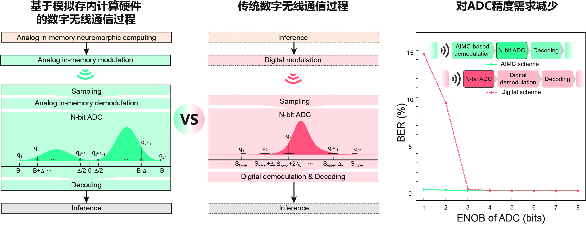
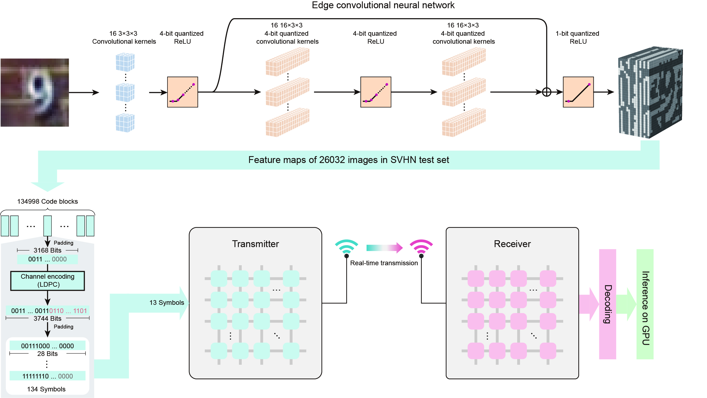
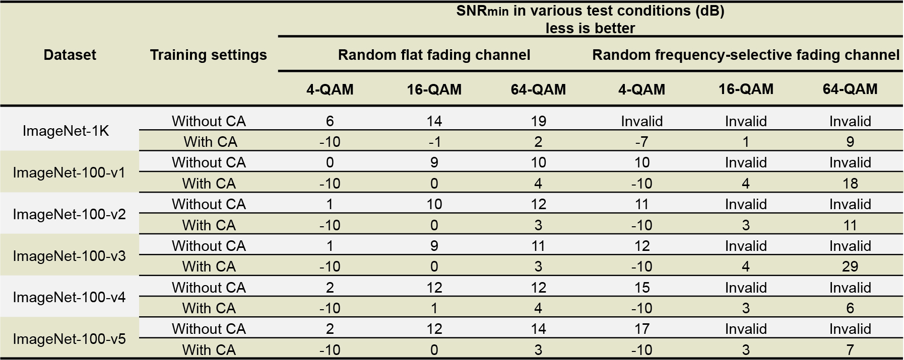

# **基于SRAM模拟存内计算硬件的边云无线协同推理系统**

## **总结**
- **构建基于SRAM模拟存内计算硬件的正交频分复用(OFDM)无线通信子系统、边端神经网络推理系统**
- **提出通信感知训练方法，将有损通信过程纳入神经网络训练过程，并进行协同优化**

---

## **基于SRAM模拟存内计算硬件的无线通信子系统**

### **与传统数字无线通信的比较与优势**

  <h2>通信过程演示视频</h2>
  

    <video controls>
      <source src="./images/communication_demo.mp4" type="video/mp4">
      您的浏览器不支持 HTML5 视频，请使用现代浏览器。
    </video>
  

### **神经网络的无线协同推理流程**

---

## **通信感知训练方法**

### **优势--大幅减少通信成本&适用于各种动态的复杂无线环境**

**通信感知训练方法相比于正常训练方法的优势（基于ImageNet数据集）**

(1) 适用于多种无线环境：使用各种调制方案（4-QAM, 16-QAM, 64-QAM），经历各种时变衰落特性的无线信道（时变平坦衰落，时变频率选择性衰落）。

(2) 通信成本大幅度降低：达到合格推理准确率所需的接受信号平均信噪比 降低16dB，等价于 发射功率降低97.5%。

---

## **成果**

**Communication-aware in-memory wireless neural networks**

**Z-Z Yang**, C Wang, Y-C Zhao, et al.

**Nature Electronics** (Major Revision)

## **代码仓库**

[**https://github.com/scramblingsnail/Communication-aware-training**](https://github.com/scramblingsnail/Communication-aware-training)

---