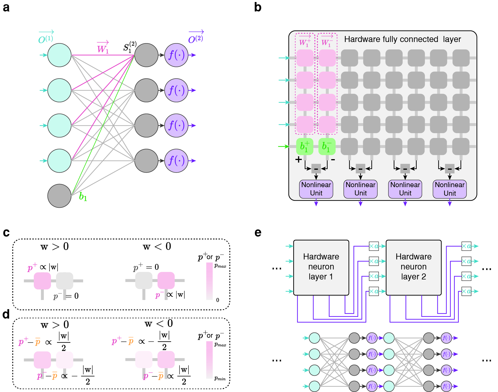
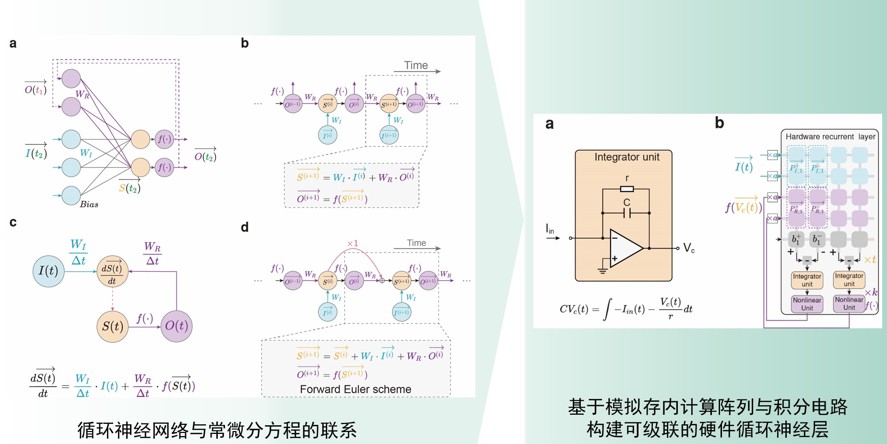
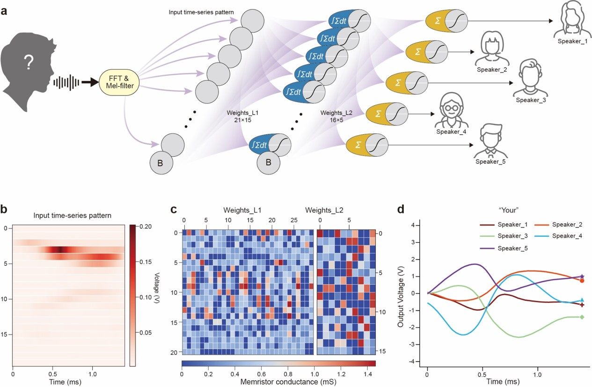
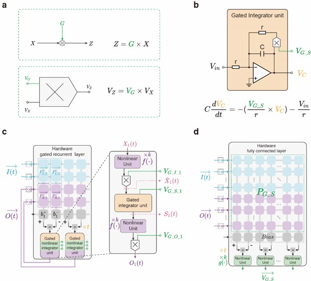
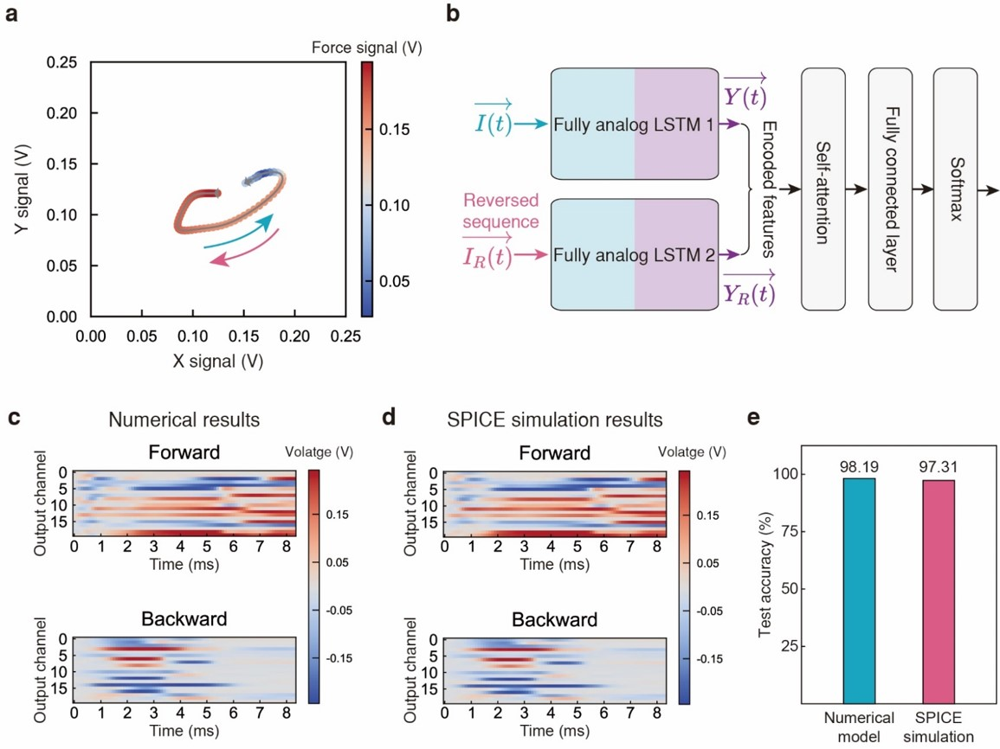
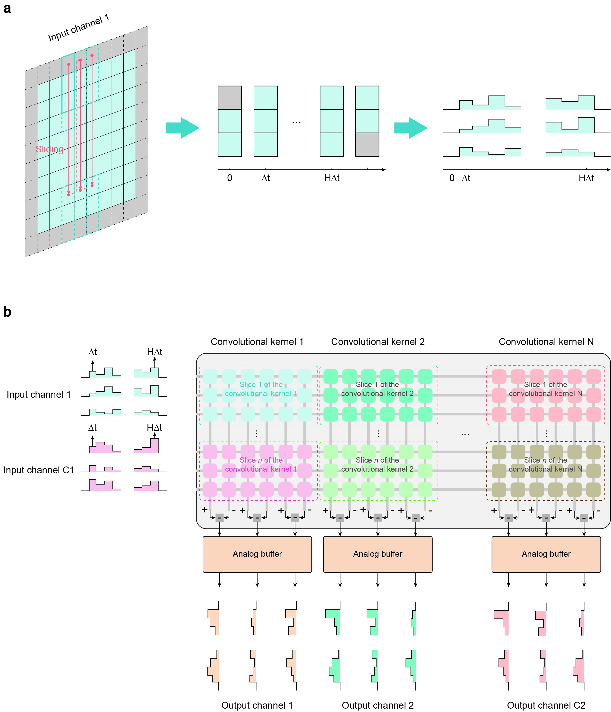
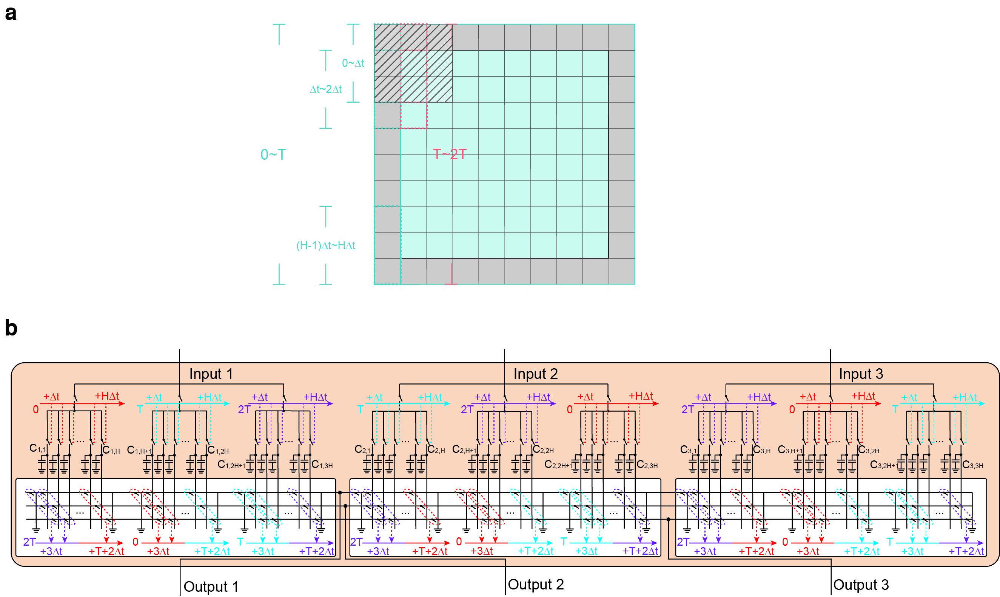

# **基于模拟存内计算硬件的全模拟域人工神经网络（FNN,RNN,CNN）**

---

## **全模拟域全连接神经网络**

### **全模拟域全连接神经网络的实现**

通过模拟存内计算阵列与非线性电路（实现非线性激活函数的左右）构成可级联的硬件全连接神经层。

### **全模拟域全连接神经网络的应用--机器人的感知、规划与运动**

  <h3>基于全模拟域全连接神经网络实现感知、规划、完成指定任务</h3>
  

    <video controls>
      <source src="./images/fnn_demo.mp4" type="video/mp4">
      您的浏览器不支持 HTML5 视频，请使用现代浏览器。
    </video>
  

### **对应成果**

Self-adaptive embodied neuromorphic intelligence using in-memory computing hardware

**Z-Z Yang†**, H Zhao†, Y-C Zhao, et al.

**Science Robotics** (Under review)

---

## **全模拟域循环神经网络**

### **全模拟域循环神经网络的实现**

利用微分方程与RNN的联系，基于模拟存内计算阵列与积分电路构建一阶微分方程描述的动力学系统，实现可级联的硬件循环神经层。

### **基于全模拟域RNN实现声纹识别**

### **全模拟域LSTM的实现**

为积分电路的反馈回路加入可控的”门“，即可实现可级联的硬件LSTM神经层

### **基于全模拟域LSTM实现手写轨迹识别**

### **对应成果**

**Physical dynamic neural networks for efficient temporal information processing** (To be submitted)

C Wang†, **Z-Z Yang†**, Y-M Zhu, et al. (To be submitted)

---

## **全模拟域卷积神经网络**

### **全模拟域卷积神经网络的实现**

基于模拟存内计算阵列与电压保持电路，经合理的时序控制，可以实现实现可级联的硬件卷积神经层。

电压保持电路（analog buffer）

---
