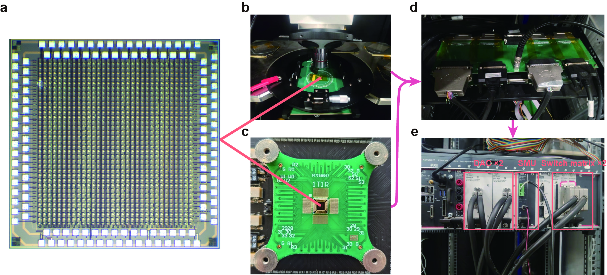
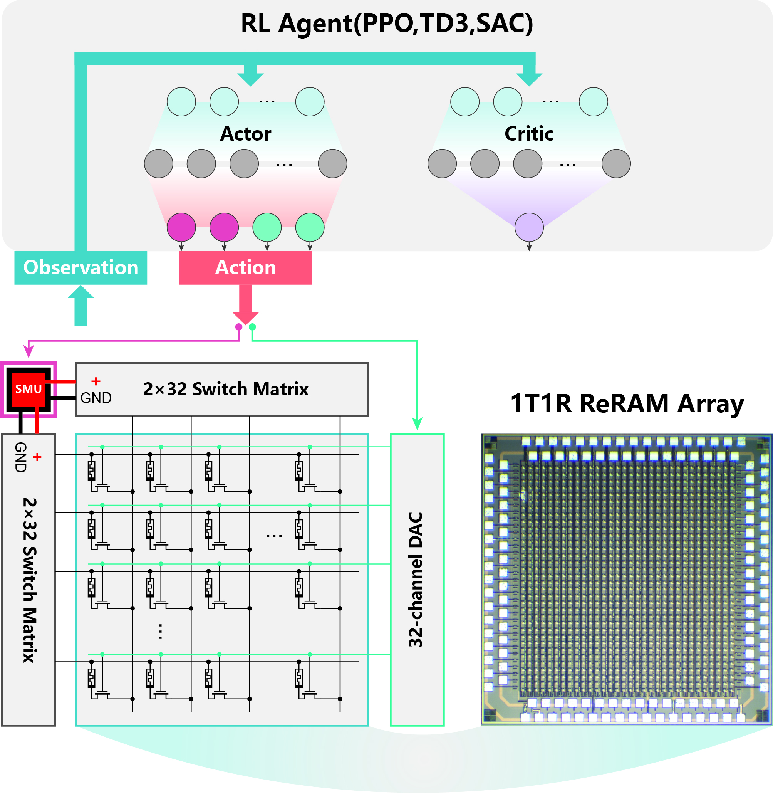
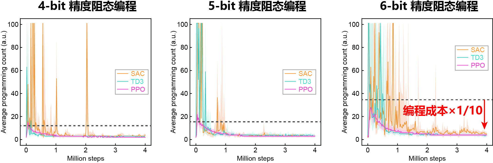

# **ReRAM阵列测试系统 & 基于强化学习的ReRAM阻态编程方案**

---

## **搭建ReRAM阵列测试系统**

### **成果**
多篇顶刊（**Nature Electronics**、**Nature Nanotechnology**）基于本ReRAN芯片与测试系统。

---

## **基于深度强化学习方法优化ReRAM的阻态编程策略**

### **成果**
将ReRAM的阻态编程成本降低为业内传统方法的 **十分之一**。

**论文**：Efficient and generalizable memristor programming strategies based on reinforcement learning

**Z-Z Yang**, et al. (In preparation)

---
